# Redesign Codex UI

一个面向 Codex 的开源 UI 改版 Skill。它可以把参考图、目标用户角色或指定视觉风格，翻译成当前 Codex 项目中的设计系统、组件改造与可验证的前端实现。

## 能做什么

- 根据一张或多张参考图分析布局、层级、色彩、字体、密度与交互语言
- 根据「工程师、创始人、研究员、新手」等角色调整信息架构与操作优先级
- 制作偶像、演员、歌手、明星、虚拟角色、原创 IP 或个人品牌限定版，包括人物 Hero、签名、票根、胶片、唱片、应援卡、主题项目和定制 Composer
- 内置十套专属皮肤原型，包括收藏手账、舞台、电影、唱片、星空应援和个人品牌等方向
- 提供独立的人物/IP身份档案与装饰语汇库，可复用称呼、语气、栏目、纪念日、素材授权及隐私边界
- 默认使用 OPCspace 紫发 IP 形象，用户可在界面上传自己的 JPEG、PNG 或 WebP，并随时恢复默认
- 根据风格关键词或产品气质生成原创 UI 规则，而非只做表面换色
- 审计现有 Codex 前端，保留任务、对话、Composer、代码、Diff、终端和审批等关键行为
- 检测本地 Codex 源码或已安装客户端，向源码项目真正安装可回滚的主题补丁，并保护已签名应用
- 完成响应式、无障碍、构建检查和截图验收

## 安装

将技能目录复制或软链接到 Codex skills 目录：

```bash
cp -R skills/redesign-codex-ui "${CODEX_HOME:-$HOME/.codex}/skills/"
```

然后在 Codex 中显式调用：

```text
使用 $redesign-codex-ui，参考我上传的截图，把当前 Codex 界面改成更适合独立开发者的低干扰工作台。保留所有现有功能，并完成宽屏和窄屏验证。
```

也可以只提供角色或风格：

```text
使用 $redesign-codex-ui，把当前界面改成适合研究员长时间阅读的编辑部风格。
```

或者制作完整的个人主题版本：

```text
使用 $redesign-codex-ui，参考我上传的偶像主题截图和我提供的正版素材，制作一个米白与橄榄绿的限定版 Codex。需要人物 Hero、签名贴纸、主题项目、四张真实能力卡和定制输入框，并验证窄屏裁切。
```

## 默认 OPCspace IP

未提供人物素材时，所有皮肤默认使用下面的 OPCspace 紫发 IP。用户可以从界面右上角替换，或通过独立身份档案配置自己的素材；默认文件始终保留用于恢复。


默认素材是带真实 alpha 通道的 PNG，白色/棋盘背景和左上角标记均已移除；在 Hero、头像和不同颜色皮肤中不会出现白色方块。

## 仓库结构

```text
skills/redesign-codex-ui/
├── SKILL.md
├── agents/openai.yaml
├── assets/design-brief.template.md
├── assets/theme-library/
├── assets/default-identity/opcspace-ip-avatar.png
├── assets/codex-ui-adapter.template.json
├── references/
└── scripts/
```

技能本体及资源位于 [`skills/redesign-codex-ui`](skills/redesign-codex-ui)。

## 十套皮肤的本地 Codex 测试

十套皮肤先在功能结构等价的本地 Codex 预览壳中逐套验证；仓库还包含一个可运行的 Codex 源码夹具，用于验证安装器确实改写 HTML、加载 CSS 和透明 IP 素材，并能完整回滚。截图不是独立绘制的静态效果图。

自动化测试会逐套检查：主题载入、侧栏和 Composer 可见、四张能力卡存在、能力卡能写入 Composer，以及浏览器无控制台错误。

### Keepsake Olive · 收藏手账

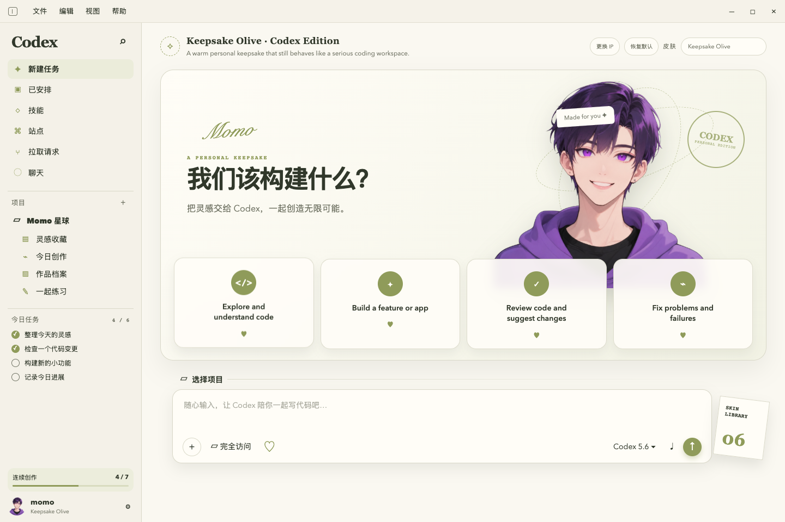

### Midnight Stage · 舞台应援

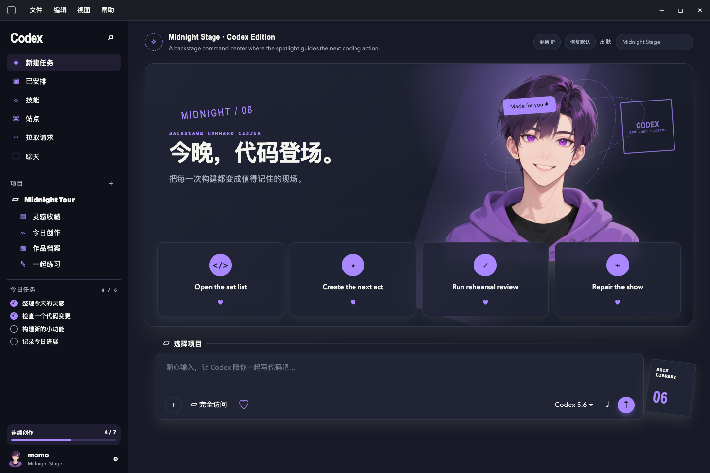

### Editorial Muse · 杂志写真

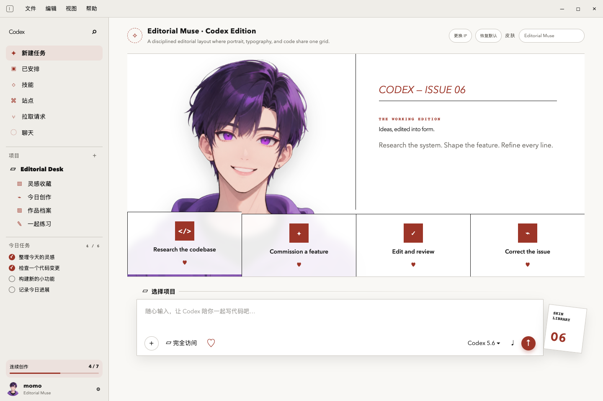

### Pixel Companion · 像素伙伴

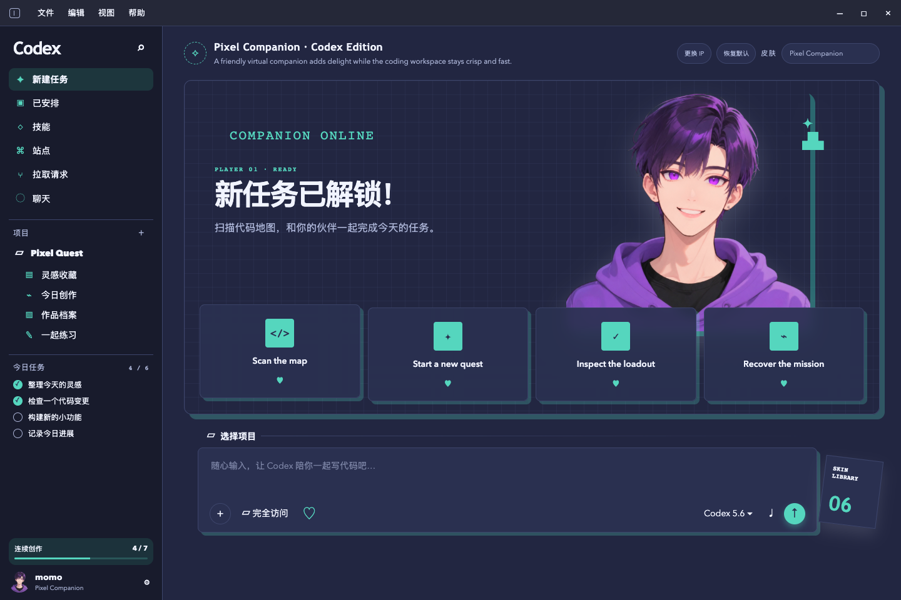

### Storybook Garden · 绘本花园

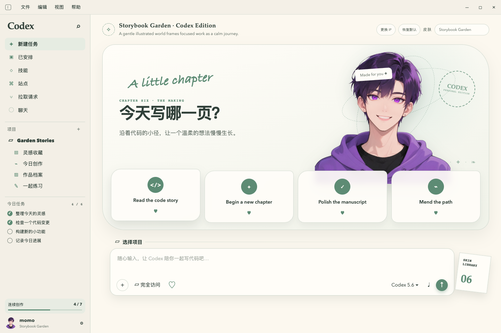

### Quiet Monogram · 极简个人品牌

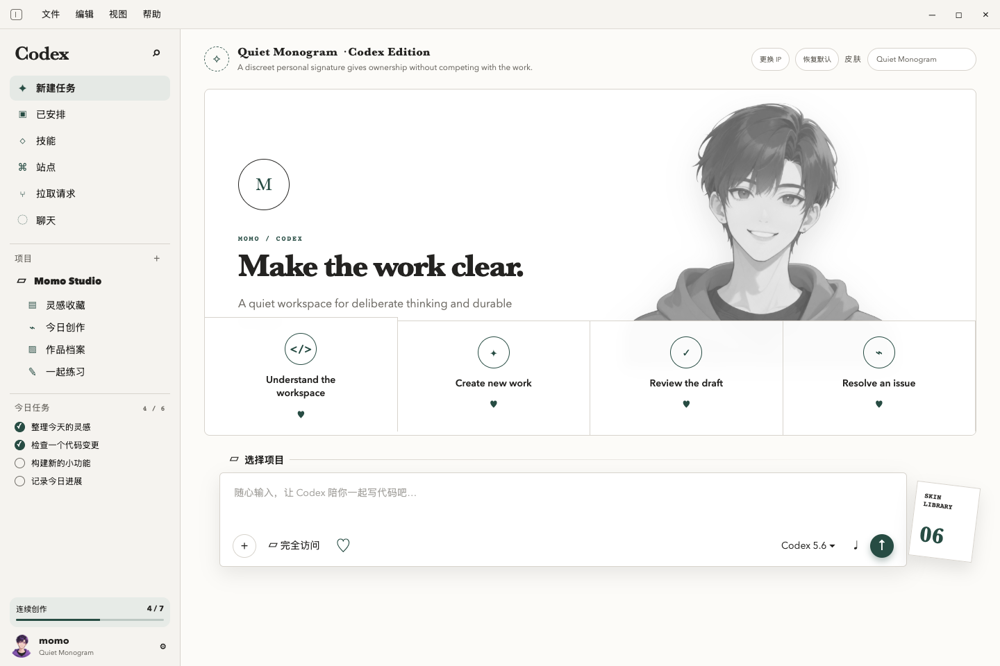

### Red Carpet Noir · 红毯电影明星

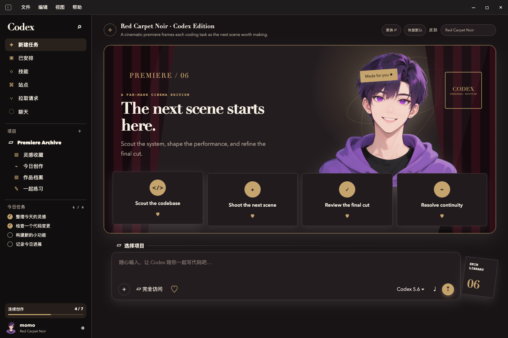

### Cinema Contact Sheet · 电影胶片档案

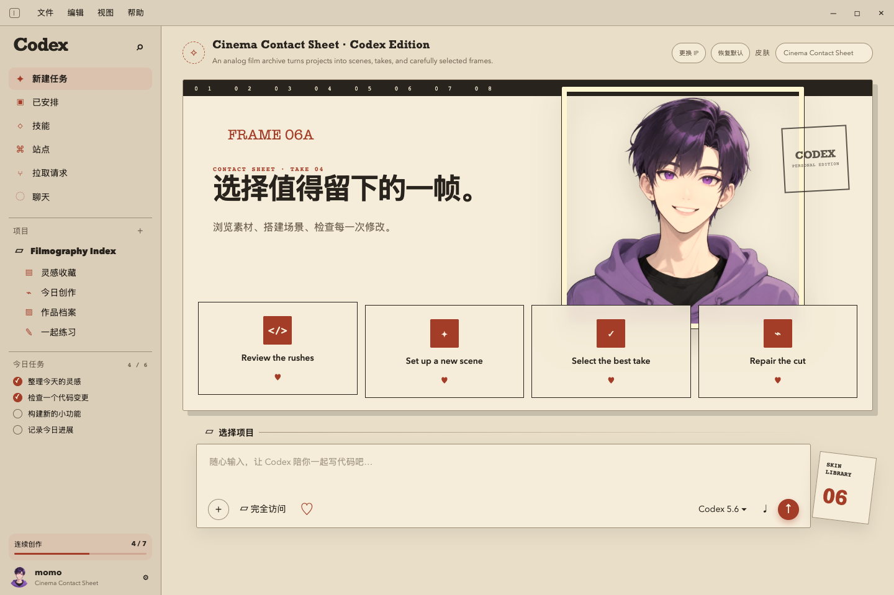

### Vinyl Archive · 明星唱片收藏

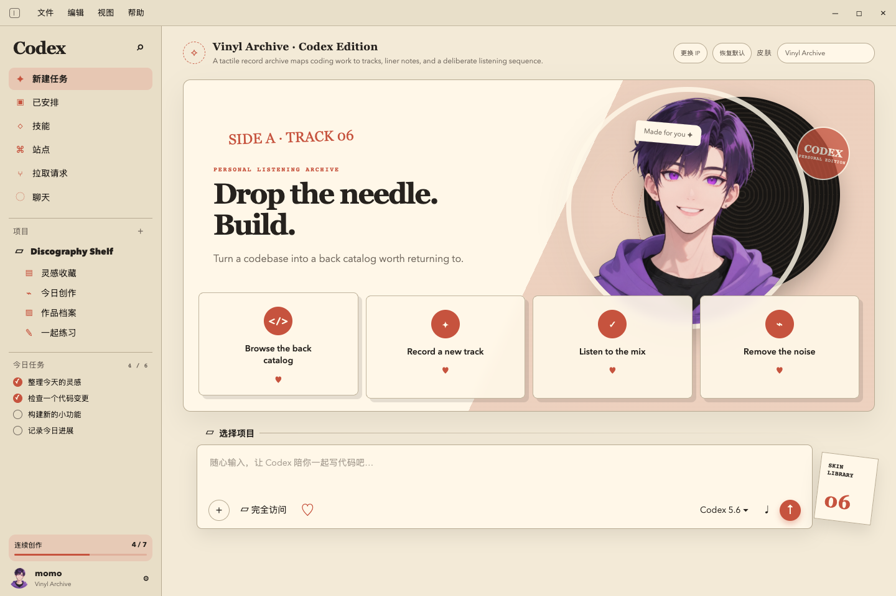

### Celestial Fanclub · 星空应援会

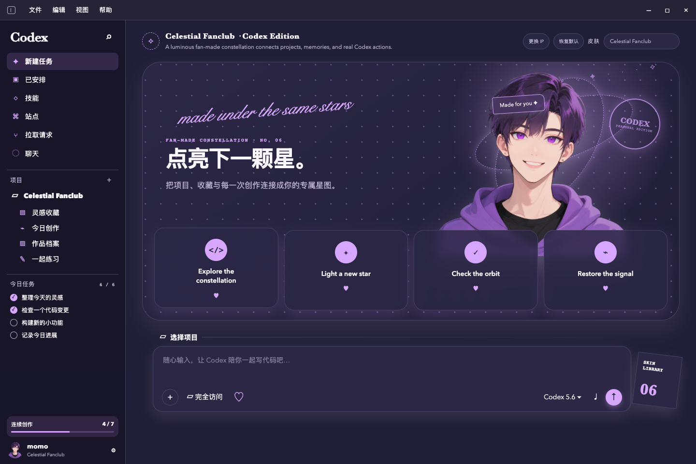

### 本地运行

```bash
npm install
npm run preview
```

打开 `http://127.0.0.1:4173/preview/`，可从右上角切换十套皮肤。另开一个终端执行截图测试：

```bash
npm run capture
```

右上角“更换 IP”支持选择用户自己的图片，选择结果仅保存在当前浏览器本地；“恢复默认”会重新使用 OPCspace 紫发 IP。用于源码项目时，也可以生成独立身份包：

```bash
python3 skills/redesign-codex-ui/scripts/create_identity_profile.py \
  --image /path/to/my-ip.png \
  --display-name "My IP" \
  --output /path/to/local-codex/.codex-theme/identity
```

## 修改本地 Codex UI

先以只读方式检测本地 Codex 的安装类型、`app.asar` 和签名状态：

```bash
python3 skills/redesign-codex-ui/scripts/detect_local_codex.py
```

如果有 Codex 前端源码或受支持的自定义主题入口，可导出皮肤补丁包：

```bash
python3 skills/redesign-codex-ui/scripts/export_theme_bundle.py \
  skills/redesign-codex-ui/assets/theme-library/presets/red-carpet-noir.json \
  --output /path/to/local-codex/.codex-theme
```

补丁包含作用域隔离的 CSS 变量和集成清单。对于代码签名保护、资源密封的已安装客户端，Skill 默认不会直接修改主应用；应优先使用源码版本或官方主题入口，制作独立旁路副本必须获得用户明确授权。

对于 HTML 入口的可编辑源码，复制适配器模板并填写项目中的真实选择器：

```bash
cp skills/redesign-codex-ui/assets/codex-ui-adapter.template.json \
  /path/to/local-codex/.codex-ui-adapter.json

python3 skills/redesign-codex-ui/scripts/apply_theme_to_source.py \
  --target /path/to/local-codex \
  --preset skills/redesign-codex-ui/assets/theme-library/presets/keepsake-olive.json \
  --identity skills/redesign-codex-ui/assets/default-identity/opcspace-ip-avatar.png
```

安装器会直接修改源码入口、写入实际加载的主题 CSS、复制透明人物素材，并在 `.codex-skin/` 保存变更清单和备份。恢复命令：

```bash
python3 skills/redesign-codex-ui/scripts/apply_theme_to_source.py \
  --target /path/to/local-codex --restore
```

仓库内的实装/回滚验证可直接运行：

```bash
python3 tests/test_source_installer.py
```

下面这张图来自安装器实际处理后的本地源码夹具，浏览器测试同时检查了 `body[data-codex-skin]`、主题样式链接、计算后的画布颜色和透明人物素材加载：

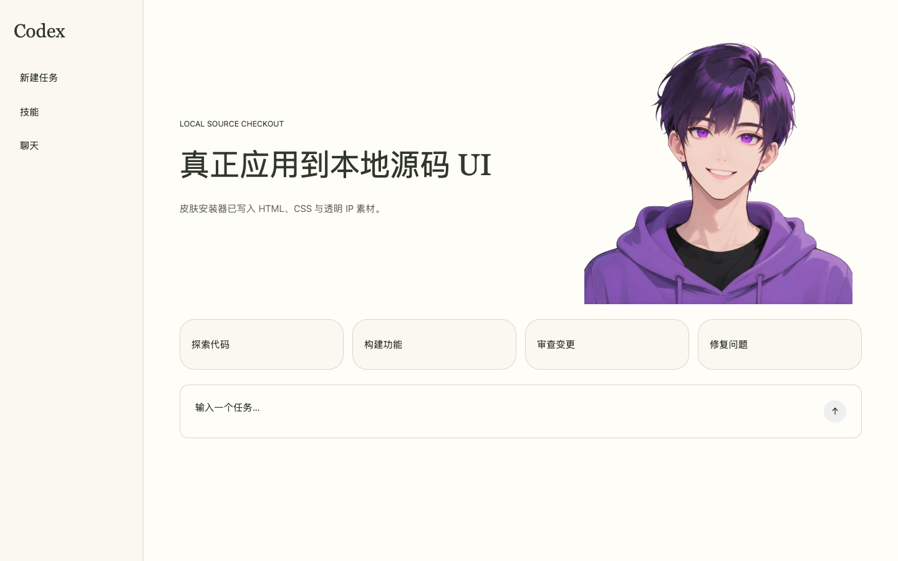

## 开源许可

MIT License。可自由使用、修改和分发；引用第三方界面时，请遵守其商标、版权和品牌资产许可。
